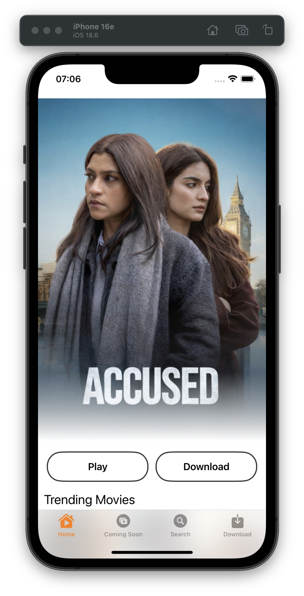
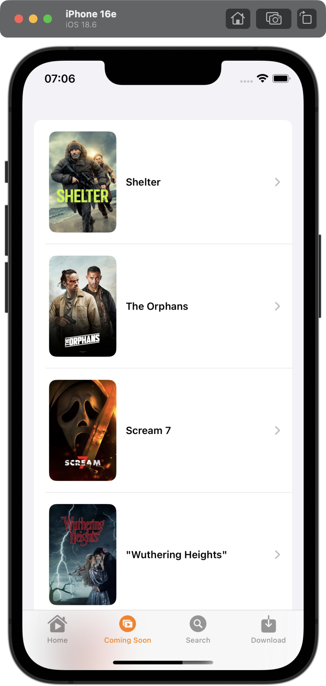
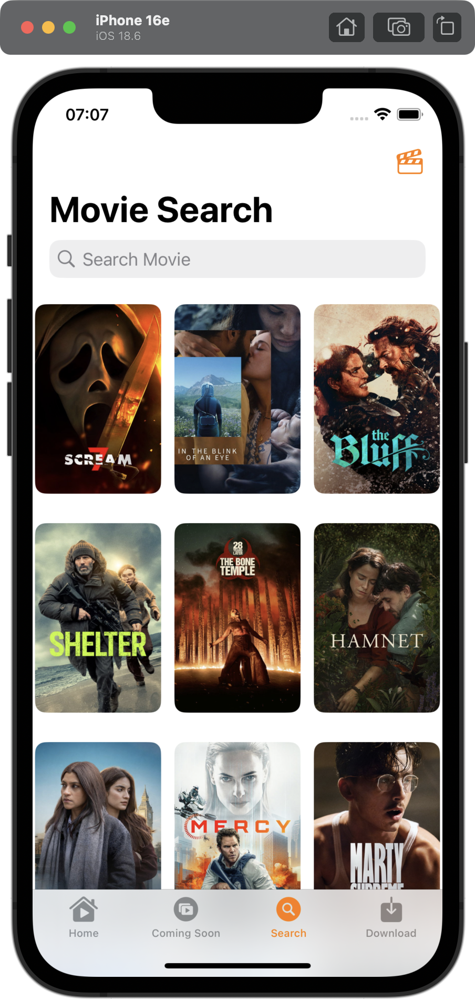
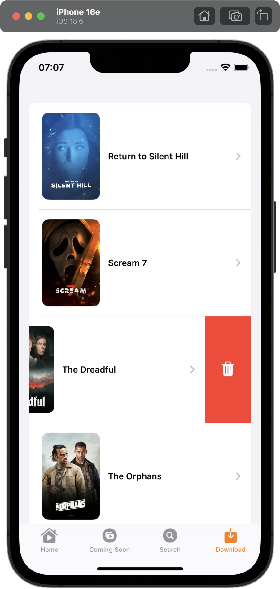

# 🎬 MovieApp iOS

A modern movie browsing iOS application built using **SwiftUI** and **MVVM architecture**.
The app integrates with the TMDB API to fetch real-time movie data and uses the YouTube API to stream official trailers.

---

## 🚀 Features

- Browse trending and popular movies
- View detailed movie information
- Search movies in real time
- Watch official trailers (YouTube integration)
- Coming Soon section
- Download screen UI

---

## 🛠 Tech Stack

- Swift
- SwiftUI
- MVVM Architecture
- Swift Concurrency (async/await)
- URLSession
- TMDB REST API
- YouTube Data API
- iOS 16+

---

## 🧠 Architecture

The project follows the **MVVM** pattern:

- **Model** → API response models
- **View** → SwiftUI Views
- **ViewModel** → Handles business logic and API communication

Networking is implemented using `URLSession` with modern Swift Concurrency (`async/await`) for clean and efficient asynchronous code.

---

## 📱 Screenshots

### Home

### Coming Soon

### Search

### Downloads

---

## 📱 App Preview

  
  
  
  

---

## ⚠️ Setup

API keys have been removed for security reasons.
To run the project:

1. Get your API key from TMDB
2. Get your YouTube Data API key
3. Insert them inside your APIConfig file

